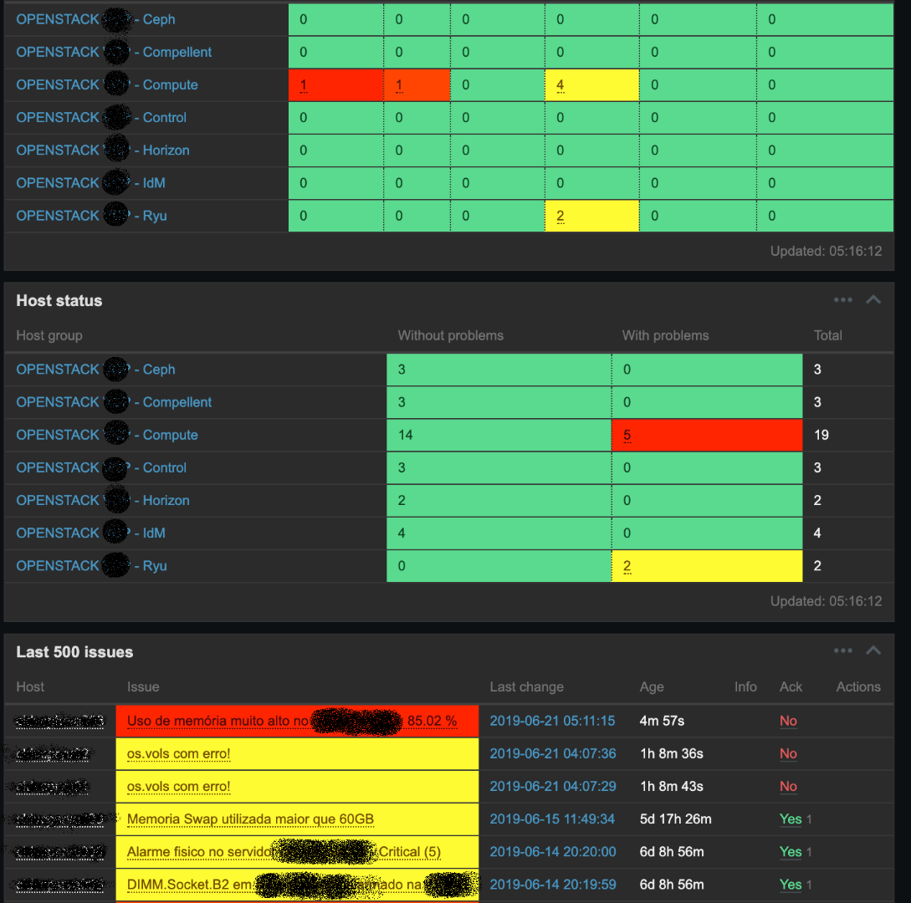

# zabbix-for-openstack
Zabbix templates customization for OpenStack (through Zabbix user parameters).

In the following screenshot you can see the final result:

As you can see, hosts are segregated by groups (controllers, compute, ceph, external Horizon, IdM, storage, etc.), and the items we monitore in each group are different.

Some things we do monitor:
 - SNMP of the servers IPMI 
 - CPU (specially load above 30), memory (above 85% because of KSM), disk and network interfaces
 - Status of the network bonds 
 - Number of processes/workers for each OpenStack Linux service (nova-scheduler, nova-api, etc.)
 - Response times of every OpenStack API
 - Status of Open vSwitch services
 - Pacemaker cluster status
 - Galera SQL cluster status
 - Health of RabbitMQ e Redis
 - Status of OpenStack agents
   - Nova: openstack compute service list
   - Neutron: openstack agent list
   - Cinder: openstack volume service list
 - The presence of virtual machines, volumes or volume snapshots in error state
 - Storage
 - Presence of failed multipath routes
 - Problems with LVM mappings
 - Incongruences with the Device Mapper (DM)
 - etc. 
 
Some Zabbix user parameters needed modifications in standard SELinux policies in order to properly work.
 
Besides this, we have another separated Zabbix server specifically to monitor capacity of the environment. In this second server we monitor:
 - Number of virtual routers
 - Number of namespaces in the controller nodes
 - Number of virtual machines
 - Number of assigned floating IPs
 - Memory used by virtual machines
 - vCPUs used
 - Storage IOPs / throughput
 - North-South traffic
 - etc.
 
The templates will surely need some customization work to adapt to each client environment. They include an Ansible playbook to automate the Zabbix agent installation along with firewall liberations, sudoers file customizations, Zabbix user agents and corresponding scripts, SELinux policies, etc.

I hope it helps.
